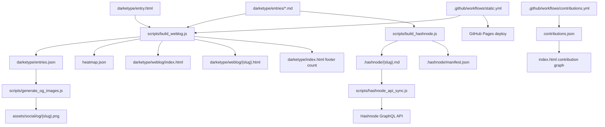
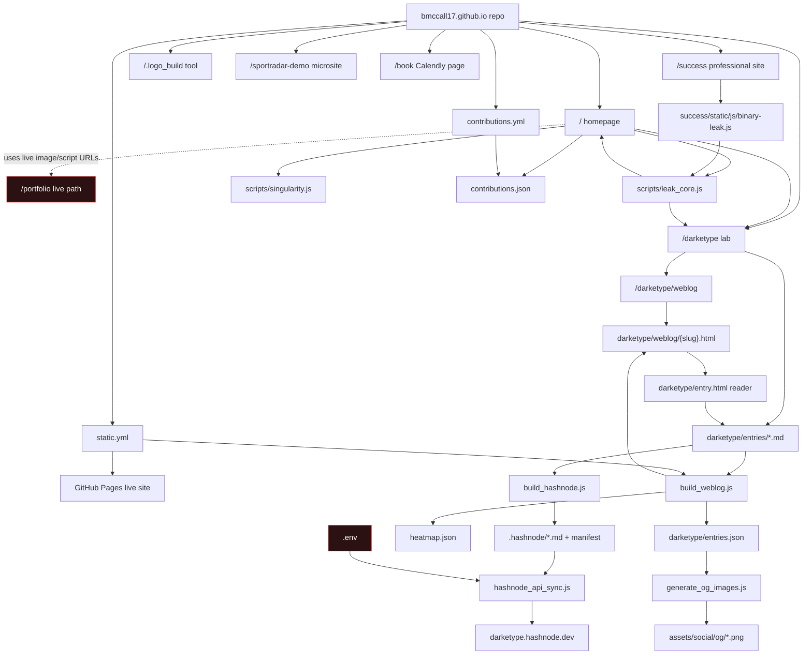

# Architecture Scouting Report

Generated: 2026-04-29  
Scope: local repo at `/home/brett/projects/bmccall17.github.io` plus live checks against `https://bmccall17.github.io/`

This is a current-state reference for humans and agents. It describes how the repo and deployed site are actually arranged right now, not an aspirational target architecture.

## Executive Summary

- This is a static GitHub Pages site, built mostly from hand-authored HTML, CSS, vanilla JavaScript, Markdown, and generated assets.
- The core product idea is "two public selves": a polished portfolio/surface and a messy public lab called `darketype`.
- `darketype/entries/*.md` is the main content source of truth. Build scripts generate list data, heatmap data, per-entry HTML shells, Open Graph images, and Hashnode proxy files.
- The live site is broader than the current local repo. `https://bmccall17.github.io/portfolio/` and `/portfolio/static/...` are live, but there is no `portfolio/` directory in the current working tree. The current repo has `success/`, which appears to be the newer professional surface with parallel assets.
- At scan start the repo was clean on `main`, but `.env` is currently tracked and `.gitignore` does not ignore it. I did not read its contents. Treat this as a high-priority hygiene issue.
- Browser Use was attempted through the in-app runtime. It could list the selected tab, but navigation and screenshots failed with an app-server path error, so live route verification used direct web clicks/fetches and HTTP status checks.

## Repo Topology

| Area | Role | Primary files |
| --- | --- | --- |
| Root homepage | Main public surface, project grid, contribution graph, singularity canvas, Darketype bridge | `index.html`, `css/main.css`, `css/singularity.css`, `scripts/singularity.js`, `scripts/leak_core.js`, `contributions.json` |
| Darketype | Messy lab, manifesto, weblog, Markdown reader, entry archive | `darketype/index.html`, `darketype/entry.html`, `darketype/weblog/index.html`, `darketype/entries/*.md`, `darketype/entries.json`, `heatmap.json` |
| Darketype effects | Glitch, viscous text, sidebar canvas modes | `darketype/css/style.css`, `darketype/scripts/viscous.js`, `darketype/scripts/sidebar.js` |
| Build scripts | Generate weblog, Hashnode proxy files, OG images, API sync | `scripts/build_weblog.js`, `scripts/build_hashnode.js`, `scripts/generate_og_images.js`, `scripts/hashnode_api_sync.js` |
| Professional success site | Job-targeted Technical Success Manager surface and case studies | `success/index.html`, `success/case-study-*.html`, `success/static/css/v2-design.css`, `success/static/js/binary-leak.js`, `success/static/js/update-gate.js` |
| Sportradar demo | Standalone IDP/Port.io demonstration microsite | `sportradar-demo/*.html`, `sportradar-demo/site.css`, `sportradar-demo/runofshow/*` |
| Logo factory | Interactive SVG logo generation tool | `.logo_build/index.html`, `.logo_build/app.js`, `.logo_build/style.css` |
| Call booking | Calendly page and aliases | `book/index.html`, `bookable/index.html`, `call/index.html` |
| Assets | Favicons, OG images, thumbnails, project images | `assets/**`, `success/static/images/**`, `darketype/entries/media/**` |
| Agent docs | Local operating rules and workflows | `.agent/RULES.md`, `.agent/workflows/*.md` |
| Hashnode artifacts | Generated publishable Markdown and manifest for external blog mirror | `.hashnode/*.md`, `.hashnode/manifest.json` |
| Root `cmo*.md` files | Hashnode/CUID-flavored Markdown exports, not part of the active Darketype source model | `cmo*.md` |

Current local file shape:

- 119 Markdown files
- 58 HTML files
- 15 JavaScript files
- 9 CSS files
- 82 PNG files
- 6 JSON files

## Live Route Map

Checked on 2026-04-29.

| Route | Live status | Title / behavior | Local source |
| --- | ---: | --- | --- |
| `/` | 200 | `brett a mccall (bmccall17)` homepage with telemetry HUD, project grid, contribution heatmap, Darketype links | `index.html` |
| `/darketype/` | 200 | Manifesto: `the art of mess making` | `darketype/index.html` |
| `/darketype/weblog/` | 200 | 37-entry weblog index across 10 states | `darketype/weblog/index.html`, regenerated by `scripts/build_weblog.js` |
| `/darketype/weblog/{slug}.html` | 200 | Static entry shell with OG tags. Body loads client-side from Markdown, so non-JS fetchers see the loading shell | generated from `darketype/entry.html` |
| `/.logo_build/` | 200 | Interactive BAM Logo Factory | `.logo_build/index.html` |
| `/scripts/test_binary_toggle.html` | 200 | Pixel vacuum test bench | `scripts/test_binary_toggle.html` |
| `/success/` | 200 | Technical Success Manager professional surface | `success/index.html` |
| `/sportradar-demo/` | 200 | Internal Developer Platform demo hub | `sportradar-demo/index.html` |
| `/book/` | 200 | Calendly inline booking page | `book/index.html` |
| `/bookable/` | 200 | Redirect alias to `/book` | `bookable/index.html` |
| `/call/` | 200 | Redirect alias to `/book` | `call/index.html` |
| `/portfolio/` | 200 | Legacy/current live portfolio surface | Not present in current local working tree |
| `/portfolio/static/...` | 200 | Live images/scripts used by root homepage project cards | Not present locally, but parallel files exist under `success/static/...` |

## Click-Through Findings

The visible user journey currently works like this:

1. Homepage `/` presents Brett identity, social links, a project grid, contribution heatmap, telemetry HUD, and two Darketype entry points: `view_system_logs();` and `enter_darketype_mode();`.
2. `enter_darketype_mode();` opens `/darketype/index.html`, the manifesto and workshop hub.
3. `[ enter the weblog ]` opens `/darketype/weblog/index.html`, a chronological list of 37 entries.
4. Entry links open generated pages under `/darketype/weblog/{slug}.html`. The page title and OG tags are static, but the visible body is hydrated by JavaScript from `darketype/entries/{slug}.md`.
5. Workshop tools open `/.logo_build/`, `darketype/staging/per-char.html`, `https://www.agent828.com/prototypes`, and `/scripts/test_binary_toggle.html`.
6. The professional path is split: `/success/` exists locally and live, while `/portfolio/` is also live and is still referenced by homepage image URLs.

## Runtime Systems

### Homepage

`index.html` is a single hand-authored page with substantial inline CSS and small inline scripts. It also imports:

- `css/main.css` for the main site layout.
- `css/singularity.css` for the black-hole/singularity visual layer.
- `scripts/singularity.js` for the canvas particle system, telemetry HUD, entropy slider, mobile controls, and logo-factory easter egg.
- `scripts/leak_core.js` for cross-site leakage behavior.
- PostHog inline analytics.
- Calendly widget assets.

The homepage fetches `contributions.json?t=...` to render a GitHub-style contribution graph. If that fails, it renders a fake randomized graph fallback.

### Cross-Site Leakage Protocol

`scripts/leak_core.js` is the bridge between the polished surface and Darketype. It:

- Reads and writes `localStorage.darketype_infection_level`.
- Increases infection when visiting Darketype on `bmccall17.github.io` or `localhost`.
- Maps infection level to entropy.
- Mutates internal/outbound target links by appending `entropy` and `origin` query parameters on click.
- Exposes `window.CSLP`.

`success/static/js/binary-leak.js` reads the same `darketype_infection_level` value and makes the professional site show green edge pixels and occasional `darketype` glyph mutations as infection increases.

### Darketype

Darketype is the strongest system boundary in the repo. It has:

- A manifesto landing page at `darketype/index.html`.
- Canonical Markdown entries in `darketype/entries/*.md`.
- A template reader at `darketype/entry.html`.
- Generated static shells in `darketype/weblog/*.html`.
- A generated index in `darketype/weblog/index.html`.
- Generated metadata in `darketype/entries.json`.
- Generated heatmap data in `heatmap.json`.
- Generated social images in `assets/social/og/*.png`.
- A Hashnode mirror layer in `.hashnode/`.

Entry pages use Marked, DOMPurify, ViewerJS, and Twitter widgets from CDNs. The reader parses simple YAML-like frontmatter, renders Markdown into `#content`, fills metadata, wires the `.md` download or Medium link, and adds a Hashnode link when `.hashnode/manifest.json` maps the slug.

### Professional Success Site

`success/index.html` is a separate professional portfolio surface aimed at Technical Success Manager / platform engineering roles. It imports:

- `success/static/js/binary-leak.js`
- `success/static/js/update-gate.js`
- `success/static/css/v2-design.css`
- Colcade from CDN
- PostHog and Calendly

The case-study pages are standalone static HTML files sharing `v2-design.css`, with additional inline styles.

### Sportradar Demo

`sportradar-demo/` is a self-contained static microsite. It models an Internal Developer Platform / Port.io challenge narrative with pages for company scale, engineering, game-day reliability, and solution architecture. The `runofshow/` subsite has mission-control JavaScript with drawers, a timer, keyboard shortcuts, and localStorage-backed checklist state.

### Logo Factory

`.logo_build/` is a full client-side SVG editor. `app.js` owns the control schema, randomized defaults, SVG rendering, filters, exports, backgrounds, and download behavior. It is reachable directly and through Darketype workshop links.

## Build And Data Flows

Important build details:

- `npm run build` runs `build_weblog`, `generate_og_images`, and `build_hashnode`.
- GitHub Pages CI currently runs only `node scripts/build_weblog.js` before deployment.
- The Pages workflow commits rebuilt `heatmap.json`, `darketype/entries.json`, and `darketype/weblog/index.html` back to `main` if changed.
- The contributions workflow runs daily at 06:00 UTC and writes `contributions.json` using the GitHub GraphQL API and `GH_CONTRIBUTIONS_PAT`.
- `hashnode_api_sync.js` loads `HASHNODE_PAT` and `HASHNODE_PUB_ID` from `.env`, then creates or updates Hashnode posts through GraphQL.

## Knowledge Graph

## Knowledge Graph Triples

| Subject | Relation | Object |
| --- | --- | --- |
| `index.html` | imports | `scripts/singularity.js` |
| `index.html` | imports | `scripts/leak_core.js` |
| `index.html` | fetches | `contributions.json` |
| `index.html` | links to | `darketype/index.html` and `darketype/weblog/index.html` |
| `index.html` | references live assets under | `/portfolio/static/images/...` |
| `darketype/index.html` | links to | `darketype/weblog/index.html` |
| `darketype/index.html` | imports | `scripts/leak_core.js` and `darketype/scripts/viscous.js` |
| `darketype/weblog/index.html` | renders | generated entry list from `darketype/entries.json` |
| `darketype/weblog/{slug}.html` | generated from | `darketype/entry.html` |
| `darketype/entry.html` | fetches | `darketype/entries/{slug}.md` |
| `darketype/entry.html` | sanitizes Markdown with | DOMPurify |
| `scripts/build_weblog.js` | reads | `darketype/entries/*.md` |
| `scripts/build_weblog.js` | writes | `darketype/entries.json`, `heatmap.json`, `darketype/weblog/*.html` |
| `scripts/generate_og_images.js` | reads | `darketype/entries.json` |
| `scripts/generate_og_images.js` | writes | `assets/social/og/*.png` |
| `scripts/build_hashnode.js` | reads | `darketype/entries/*.md` |
| `scripts/build_hashnode.js` | writes | `.hashnode/*.md` and `.hashnode/manifest.json` |
| `scripts/hashnode_api_sync.js` | uses | `.env` credentials |
| `success/static/js/binary-leak.js` | reads | `localStorage.darketype_infection_level` |
| `scripts/leak_core.js` | writes | `localStorage.darketype_infection_level` |
| `.github/workflows/static.yml` | deploys | whole repo to GitHub Pages |
| `.github/workflows/contributions.yml` | writes | `contributions.json` |

## Source Of Truth Rules

For future work, treat these as ownership boundaries:

- Darketype content source: edit `darketype/entries/*.md`, then run `npm run build`.
- Generated Darketype artifacts: avoid hand-editing `darketype/entries.json`, `heatmap.json`, `darketype/weblog/*.html`, `.hashnode/*.md`, and `assets/social/og/*.png` unless intentionally repairing generated output.
- Homepage design source: edit `index.html`, `css/main.css`, `css/singularity.css`, `scripts/singularity.js`, and `scripts/leak_core.js`.
- Professional site source: edit `success/index.html`, `success/case-study-*.html`, `success/static/css/v2-design.css`, and `success/static/js/*`.
- Sportradar demo source: edit only within `sportradar-demo/` unless extracting shared patterns.
- Logo factory source: edit only within `.logo_build/`.
- Booking source: `book/index.html` is canonical; `bookable/` and `call/` are aliases.
- Agent guidance source: `.agent/RULES.md` and `.agent/workflows/*.md`.

## Entry Schema

The active Darketype entry schema is defined by `darketype/entries/TEMPLATE.md`.

Required or expected fields:

- `title`
- `date`
- `state`
- `tags`

Optional fields:

- `series`
- `hashnode`
- `og_image`
- `next_experiment`

Known states seen in current generated data:

- `broken`
- `debugging`
- `expanded`
- `frustrated`
- `learning`
- `mess`
- `optimistic`
- `seed`
- `shipped`
- `void`

Hashnode publishing defaults:

- `scripts/build_hashnode.js` auto-publishes entries with state `shipped`, `expanded`, or `learning`, unless frontmatter overrides with `hashnode: true` or `hashnode: false`.

## Risks And Friction

1. `.env` is tracked and not ignored.
   - `git ls-files -- .env` returns `.env`.
   - `.gitignore` does not include `.env`.
   - I did not inspect the file contents.
   - Next action should be to add `.env` to `.gitignore`, remove it from tracking, and rotate any secrets that have ever been pushed.

2. Live `/portfolio/` does not match the current repo tree.
   - `/portfolio/` and `/portfolio/static/...` return 200 live.
   - No `portfolio/` directory exists locally.
   - Root homepage still references `/portfolio/static/images/...`.
   - This makes the deployed site dependent on a live path that future deploys or cleanup could break.

3. Darketype entry bodies are JS-rendered.
   - Per-entry generated HTML has static titles and OG tags, but body content is fetched from Markdown client-side.
   - This is fine for the designed interactive reader, but weak for no-JS readers, text fetchers, and some crawler surfaces.

4. Generated and source artifacts sit side by side.
   - This is intentional, but easy for agents to edit the wrong layer.
   - The repo would benefit from a short `GENERATED_FILES.md` or a comment banner inside generated HTML.

5. Analytics and Calendly snippets are duplicated inline.
   - PostHog and Calendly appear in several standalone pages.
   - Static HTML makes this understandable, but updates require repeated edits.

6. CI build is narrower than local `npm run build`.
   - CI runs `build_weblog` only.
   - Local `npm run build` also regenerates OG images and Hashnode proxy files.
   - That split may be intentional to avoid expensive image generation in CI, but agents need to know it.

7. Root-level `cmo*.md` files duplicate Hashnode-shaped content.
   - They look like Hashnode exports with CUID filenames.
   - They are not the canonical Darketype source and are not wired into the active reader.

8. Browser-based verification is currently partially blocked in the in-app browser runtime.
   - Browser Use could list the tab, but navigation and screenshots failed in this environment.
   - Direct HTTP/live web checks still verified route availability and content.

## Build-Next Opportunities

High-leverage next steps:

1. Reconcile `/portfolio/` and `/success/`.
   - Decide which is canonical.
   - Either add a local `portfolio/` path, redirect it, or update homepage asset URLs to `success/static/...`.

2. Fix secret hygiene.
   - Add `.env` to `.gitignore`.
   - Remove `.env` from tracking.
   - Rotate Hashnode credentials if the tracked file has ever reached GitHub.

3. Add a routes manifest.
   - A simple `routes.json` or Markdown table could name canonical routes, aliases, generated pages, and external dependencies.

4. Make Darketype generated pages optionally no-JS readable.
   - `build_weblog.js` could inject rendered Markdown into generated pages while retaining the current interactive reader behavior.

5. Add generated-file markers.
   - Entry pages, `.hashnode` files, `entries.json`, and `heatmap.json` should clearly state what script owns them.

6. Centralize shared snippets.
   - Extract PostHog and Calendly setup into shared local snippets if the project stays static HTML.

7. Add a verification script.
   - A small script can check key live routes, expected titles, local link existence, missing assets, and generated-data consistency.

8. Separate active content from archives.
   - Move or document root `cmo*.md` files so agents do not confuse them with the canonical entry source.

## Quick Agent Playbook

When asked to add a Darketype entry:

1. Create or edit a Markdown file in `darketype/entries/`.
2. Follow `darketype/entries/TEMPLATE.md`.
3. Run `npm run build`.
4. Review generated changes in:
   - `darketype/entries.json`
   - `heatmap.json`
   - `darketype/weblog/index.html`
   - `darketype/weblog/{slug}.html`
   - `assets/social/og/{slug}.png`
   - `.hashnode/{slug}.md`
   - `.hashnode/manifest.json`

When asked to change the homepage:

1. Start with `index.html`.
2. Check whether behavior belongs in `scripts/singularity.js` or `scripts/leak_core.js`.
3. Check whether styles belong in `css/main.css`, `css/singularity.css`, or the existing inline page block.
4. Verify live asset paths, especially anything under `/portfolio/static/...`.

When asked to change the professional site:

1. Start in `success/`.
2. Do not assume `/portfolio/` is backed by the same local files until the route split is resolved.
3. Check `success/static/js/binary-leak.js` for Darketype infection behavior.
4. Check `success/static/js/update-gate.js` for the `?update=1` / cookie gate behavior.

When asked to change deployments:

1. Read `.github/workflows/static.yml`.
2. Remember that CI currently runs only `build_weblog`.
3. Read `.github/workflows/contributions.yml` before touching `contributions.json`.
4. Do not read or expose `.env` values.

## Verification Notes

Local commands used:

- `git status --short --branch`
- file inventory via `find` and PowerShell `Get-ChildItem`
- key source reads for HTML, CSS, JS, workflows, and agent docs
- live route checks with HTTP status and title extraction

Live pages clicked or fetched:

- `https://bmccall17.github.io/`
- `https://bmccall17.github.io/darketype/index.html`
- `https://bmccall17.github.io/darketype/weblog/index.html`
- `https://bmccall17.github.io/darketype/weblog/2026-04-18_the_hashnode_bridge.html`
- `https://bmccall17.github.io/.logo_build/index.html`
- `https://bmccall17.github.io/scripts/test_binary_toggle.html`
- `https://bmccall17.github.io/success/`
- `https://bmccall17.github.io/sportradar-demo/`
- `https://bmccall17.github.io/book/`
- `https://bmccall17.github.io/portfolio/`
