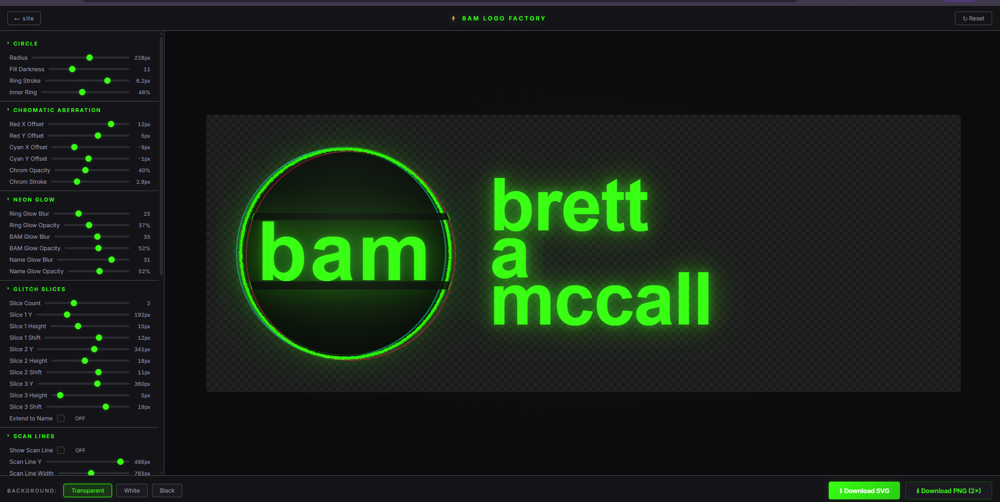

# the problem

TEDxAsheville asked for a logo. not just any logo — *our* logo. the one that represents the BAM identity on the team page. recently dissolved my old company Better Than Unicorns, so the spot on the team page where that logo used to live was empty. needed something fresh.


the obvious move: ask the AI agent to iterate on the SVG. i'm running Antigravity with Opus 4.6 right now, and it's incredible at code — but iterating on visual design through text prompts is... painful. "make the glow slightly brighter." "no, too bright." "shift the chromatic aberration 2px left." "that's too far." back and forth, forever.

# the shift

instead of asking the machine to iterate endlessly on pixel values, i asked it to build me a **tool** that would let me iterate myself. direct manipulation. sliders. live preview. real-time feedback.

the result: the BAM Logo Factory.



# the mess

- 40+ parameters exposed: circle radius, chromatic aberration offsets, neon glow blur/opacity, glitch slice positions, ring distortion, font sizes, colors... everything.
- live SVG rendering — every slider change redraws immediately.
- export to clean SVG (transparent/white/black backgrounds) or high-res PNG at 2x.
- every load is unique: a seeded PRNG (mulberry32, seeded from `Date.now()` milliseconds) randomizes all parameters within "tasteful" ranges on boot. your logo is never the same twice.
- the reset button snaps back to my canonical preset.

# the easter egg

here's the fun part: the logo factory is hidden. you can't just navigate to it.

on the root site, there's a singularity effect — green pixel cubes that you suck up with your cursor like a black hole. as you absorb more cubes, the BAM avatar in the sidebar glows progressively brighter. CSS custom property `--absorption` drives it from 0→1 in real time.

when you absorb *all* the cubes — `absorption ≥ 0.99` — the avatar starts pulsating. breathing scale, triple-layered glow bloom. and the cursor changes to a pointer.

click it. you're in.

```javascript
// the absorption ratio drives the glow
const absorptionRatio = deadCount / particles.length;
avatar.style.setProperty('--absorption', absorptionRatio.toFixed(3));

// at max, unlock the secret
if (absorptionRatio >= 0.99) {
    avatar.classList.add('singularity-maxed');
}
```

# glimmers

the meta-lesson: when AI is bad at iterating on something visual, don't fight the medium. change the medium. build the tool that lets the human do what humans are good at (direct manipulation, taste, spatial reasoning) and let the machine do what it's good at (generating the SVG rendering engine, wiring up 40 sliders, handling export logic).

also: every visitor to the logo factory sees a different version of your logo. the seed changes every millisecond. there is no canonical version until you decide there is.

# distillation

don't iterate *through* the agent. iterate *with a tool the agent builds for you*.
