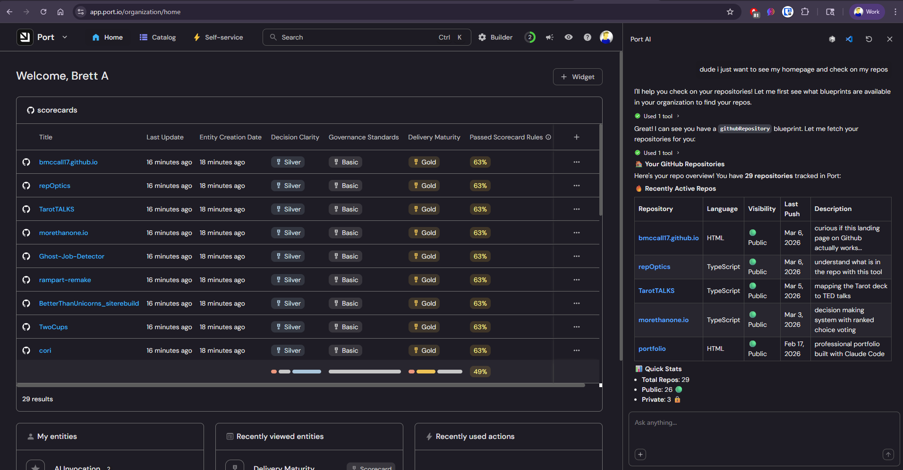

# the setup

i'm building a comparison page inside [repOptics](https://rep-optics.onrender.com/port-compare) that shows how my repo-level scoring tool stacks up against Port.io's org-scale software catalog. the plan was simple: use Port's GitHub Ocean integration to sync my repos into their catalog, create some scorecards, then render both perspectives side by side. i figured this would take 30 minutes. it took the entire evening and left me genuinely frustrated.

# the mess

## secret name chaos

port's documentation uses at least three different naming conventions for the same credentials:

- the **ocean-sail GitHub Action** expects `port_client_id` and `port_client_secret` as action inputs
- the **ocean-sail internals** convert these to `OCEAN__PORT__CLIENT_ID` and `OCEAN__PORT__CLIENT_SECRET` in an env file
- the **Port UI wizard** tells you to create GitHub secrets named `OCEAN__PORT__CLIENT_ID` and `OCEAN__INTEGRATION__CONFIG__GITHUB_TOKEN`
- the **Port API** just wants a `clientId` and `clientSecret` in a POST body

so which names do you actually use for your GitHub repo secrets? the docs don't clarify that the action's `with:` inputs map internally. the wizard shows the internal env var names as if you should use those as secret names. the result is you're staring at four different naming patterns for the same two credentials, second-guessing every combination.

## the docker image wall

after finally getting secrets sorted, the workflow fails immediately:

```
Unable to find image 'ghcr.io/port-labs/port-ocean-github:latest' locally
docker: Error response from daemon: Head "https://ghcr.io/v2/port-labs/port-ocean-github/manifests/latest": denied
```

the `ocean-sail` action tries to pull a container image from GitHub Container Registry and gets denied. no auth header, no registry login step, just a raw `docker run` against a private image. the action itself doesn't handle authentication to ghcr. this is a dead end unless the Port UI wizard's "Connect" button somehow provisions access — but that button was grayed out.

## the grayed-out connect button

the Port UI has a multi-step wizard: Personal Access Token > CI > Prerequisites. i completed all three steps (green checkmarks). the "Connect" button at the bottom right stays grayed out. there's a "Configuration" section below the docs panel with expandable sections for "Default mapping" and "Repository type." clicking through these doesn't enable the button either. there's no error message, no validation feedback, no indication of what's missing. just a grayed-out button and a developer losing patience.

## the documentation page

the docs URL has query params that should show the right tab combination: `?auth=pat&installation-methods=one-time-ci&cicd-method=github&method=pat`. but the page uses JavaScript-rendered tabs, so if you try to share, link, or programmatically read the docs, you get a generic page with none of the specific instructions visible. the interactive elements don't degrade gracefully.

## the scorecard form

after the integration finally worked, i moved on to creating scorecards — Port's way of grading entities against rules. i got one created through the UI (Delivery Maturity) but the form for the other two kept fighting me. the conditions dropdown is unintuitive: "Properties" appears as a category header that you have to click to expand, but it looks like a label. the available properties don't show their types, so you're guessing whether `readme` is a boolean or string (it's a string — the actual README content, not a flag). operators change based on type but there's no tooltip explaining which operators work with which types.

i gave up on the form and created the remaining two scorecards via the REST API:

```bash
curl -s -X POST "https://api.getport.io/v1/blueprints/githubRepository/scorecards" \
  -H "Authorization: Bearer $TOKEN" \
  -H "Content-Type: application/json" \
  -d '{ "identifier": "decision_clarity", "title": "Decision Clarity", ... }'
```

two `curl` calls, each took about 2 seconds. the form had eaten 15+ minutes without success. this is becoming a pattern: the Port REST API is excellent, the UI layers on top of it add friction instead of removing it.

## the silent region assignment

my Port credentials only authenticate against `api.getport.io` (EU), not `api.us.getport.io` (US). i live in North Carolina. there was no region selection during signup, no confirmation of which instance i was assigned to, and no indication in the dashboard. i only discovered this by trial and error — the US endpoint returned `invalid_credentials` for perfectly valid keys. the EU endpoint worked fine. there's no "region" label in the Port UI settings, no mention in the onboarding flow. you just have to... guess? and then debug authentication failures that have nothing to do with your actual credentials.

# the fix

i gave up on `ocean-sail` entirely and wrote a workflow that talks directly to Port's REST API:

```yaml
- name: Fetch repos and upsert to Port
  run: |
    REPOS=$(curl -s -H "Authorization: token $GH_PAT" \
      "https://api.github.com/users/bmccall17/repos?per_page=100")
    echo "$REPOS" | jq -c '.[]' | while read -r repo; do
      # extract fields, upsert to Port API
      curl -s -X POST "$PORT_BASE_URL/v1/blueprints/githubRepository/entities?upsert=true" \
        -H "Authorization: Bearer $PORT_TOKEN" \
        -d "$(jq -n --arg id ... '{identifier: $id, ...}')"
    done
```

no docker image. no ocean-sail. no ambiguous secret naming. just curl, jq, and the Port REST API. it worked on the first try.

# the learning

1. **when a vendor's "easy path" is broken, go straight to the API.** the abstraction layers (ocean-sail, the UI wizard, the Docker image) all had issues. the REST API underneath worked perfectly. i should have started there.

2. **developer experience is a product decision.** port's core product concepts are genuinely powerful — software catalog, scorecards, self-service actions, entity relations. but the onboarding experience actively undermines that. conflicting secret names across docs, a wizard with no validation feedback, and a Docker image that can't be pulled without undocumented prerequisites. these aren't edge cases — this is the first-run experience.

3. **this is actually useful TSM context.** if i'm going to be a Technical Success Manager at Port, i now viscerally understand what a new user hits on day one. i can advocate for fixing this because i lived it. the product is strong; the on-ramp needs work.

4. **the Port AI is the redeeming moment.** after hours of fighting wizards, grayed-out buttons, and conflicting docs, the Port AI chat actually came through. i asked it to help me get past the setup checklist and build a table view of my scorecards by repo — and it just did it. within a minute i was looking at all 13 repos with Decision Clarity, Governance Standards, and Delivery Maturity columns, color-coded by level. that's the moment Port clicked. the product underneath is genuinely powerful once you get there. the AI understood my catalog, knew what scorecards existed, and helped me build the view i wanted conversationally. if Port leaned harder into this as the onboarding path — "just talk to the AI and it'll set things up" — the entire evening of pain could have been 10 minutes.



# distillation

the best developer tools have a property: the first 5 minutes feel like magic. port's first 5 minutes felt like a puzzle with missing pieces. the API underneath is clean and well-designed. the layers on top of it need to get out of the way. but when Port's AI took the wheel, i finally saw the vision — a platform where you describe what you want and it builds the view. the rough edges are real, but so is the potential.
