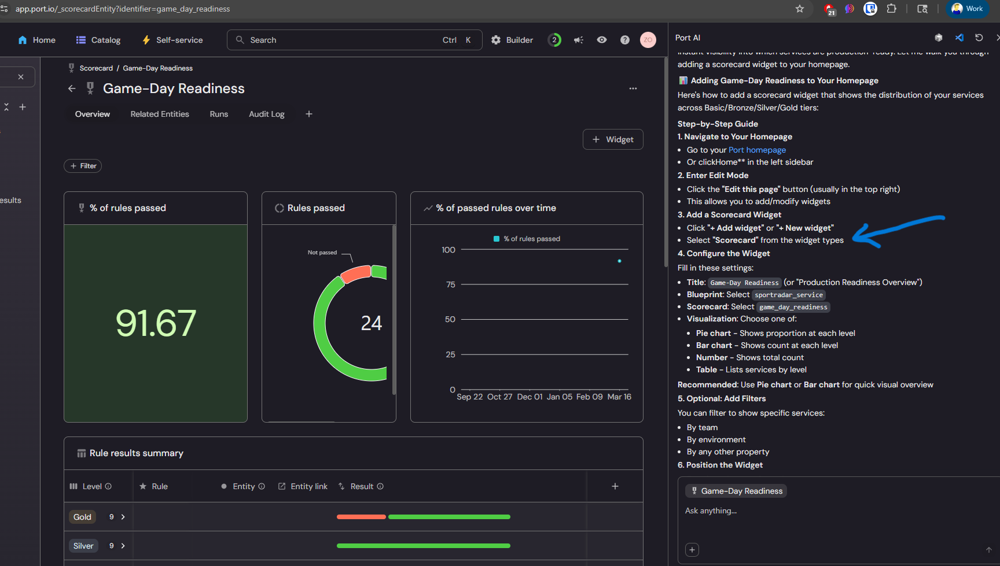
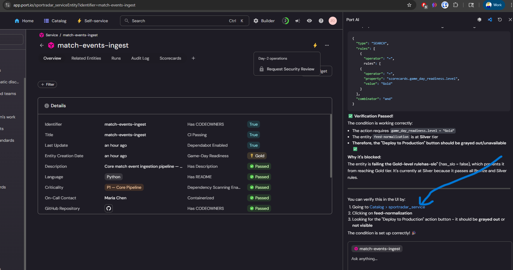
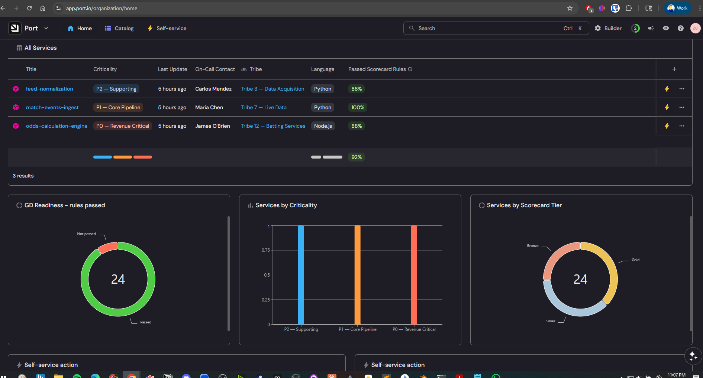
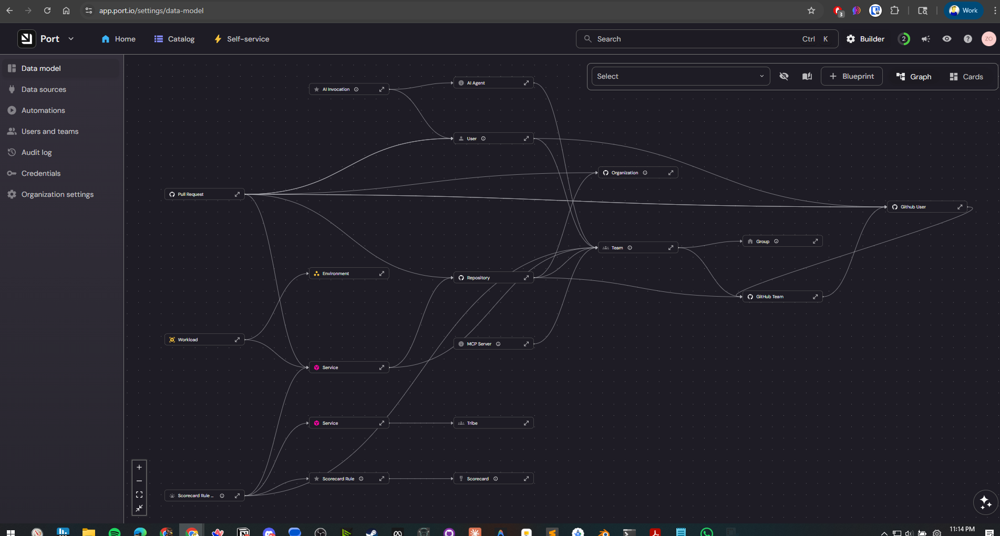
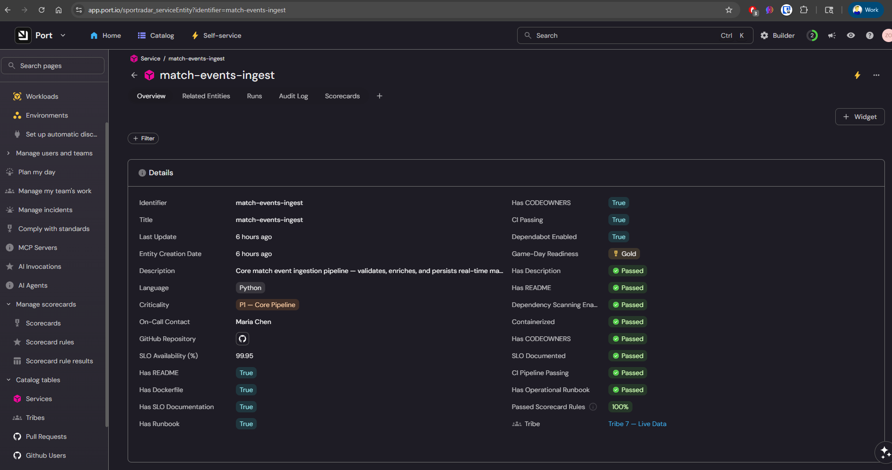

# the setup

i'm building a demo environment to illustrate how managed services can be governed within an Internal Developer Portal (IDP). the scenario: three Sportradar microservices — `feed-normalization`, `match-events-ingest`, `odds-calculation-engine` — modeled in a software catalog with a Game-Day Readiness scorecard. the demo moment: a "Deploy to Production" action that's *gated* on scorecard tier. only Gold services can deploy during live events. Silver services see the action blocked. the audience sees why scorecards matter — not as vanity metrics, but as operational guardrails.

to build the proof-of-concept, i used port.io as the IDP. 

the blueprints went in clean. three entities with properties (tribe, criticality, on-call contact, SLO targets, language). the scorecard created fine — 8 rules across CI/CD pipeline, documentation, SLO availability, dependency scanning. `match-events-ingest` hit Gold. the other two landed at Silver. the differentiation was visible and real. 91.67% rules passed across the board.



then i tried to add the actual gate.

# the mess

## the deprecated endpoint dance

first attempt: making an API call to create the action endpoint that the tool's own documentation and AI assistant both suggest.

```json
{
  "ok": false,
  "message": "This endpoint is deprecated. Please use '/actions' instead."
}
```

no warning in the docs. no deprecation notice on the API reference page. just a flat rejection at runtime. fine — switch to the new endpoint. but the new endpoint has a different schema contract: if you include a `condition`, you now *must* include the identifier implicitly inside the `trigger` object. the old endpoint inferred it from the URL path. the new one doesn't.

```json
{
  "ok": false,
  "message": "\"trigger\" must have property blueprintIdentifier when property condition is present"
}
```

two errors deep and i haven't even gotten to the actual condition yet.

## the condition schema lottery

here's the condition i wanted — a JQ expression that checks if the entity's scorecard level is Gold:

```json
"condition": {
  "type": "JQ",
  "expressions": [
    ".entity.scorecards.game_day_readiness.level == \"Gold\""
  ],
  "combinator": "and"
}
```

this is what the tool's documentation showed. `expressions` array, `combinator`, `type: "JQ"`. clean, readable, makes sense.

the API disagrees:

```json
{
  "ok": false,
  "message": "\"trigger/condition\" must have required property 'rules'"
}
```

`expressions` is rejected. the API wants `rules`. so i restructure:

```json
"condition": {
  "type": "JQ",
  "combinator": "and",
  "rules": [
    {
      "operator": "JQ",
      "value": ".entity.scorecards.game_day_readiness.level == \"Gold\""
    }
  ]
}
```

gave up on the API at this point and tried the UI. pasted the JSON into the condition editor. red squiggle: **"Value must be SEARCH."** the UI workflow wouldn't accept `JQ` as a condition type. the API wouldn't accept `expressions`. the docs showed `expressions`. three different schemas for the exact same concept depending on where you're configuring it.

i finally tried the `SEARCH` type in the UI. it accepted the condition — but instead of showing "Deploy to Production" as visually blocked for Silver services, the action disappeared entirely using that logic. the gating didn't show a locked door. it removed the door from the hallway. the exact demo moment i needed — "see, this service *can't* deploy because it's Silver" — was impossible. the action just vanished from the portal.

## AI assistants: from hero to liability

when setting this up initially, the IDP's native AI assistant was the redeeming moment. after hours of fighting wizards and grayed-out buttons, i asked the AI for help and it just *worked*. built a scorecard table view in under a minute. i thought: "if they leaned harder into this as the onboarding path, the entire evening of pain could have been 10 minutes."

a few days later, i asked the same AI for help creating the deploy action. it generated a bash script. here's what the script contained:

```bash
PORT_CLIENT_SECRET="_API_URL="https://api..."
```

the secret and the API URL smashed into one variable assignment. it gets worse:

```bash
TOKENPORT_API_URL}/auth/access_token" \
```

the token curl command with the variable name eaten by the URL. and:

```bash
curl -s -X POST "${PORT_API_URLrints/sportradar_service/actions" \
  "identifier": "deploy_": "Deploy to Production",
```

the URL mangled (`URLrints` instead of `URL}/blueprints`), the identifier and title smashed together (`"deploy_": "Deploy"`), and at the bottom of the bash script — literal markdown:

```
**What I changed:**
**Run this now** and it should work!
```

markdown. in a bash script. with emoji.

this isn't a hallucination in the interesting sense. the AI didn't make up a plausible-sounding wrong answer. it generated text that wouldn't pass a syntax check. truncated variable names, mangled URLs, mixed format languages. the thing that saved me earlier is now generating code that would fail `bash -n`.

the AI also kept referring to `sportradar_service` as if it were an entity name rather than a blueprint identifier. the UI displays the blueprint *title* ("Service") not its *identifier* (`sportradar_service`), so even the AI gets confused about what things are called inside its own platform context.



# the fix

i eventually gave up on the hard gate. created the Deploy to Production action without a condition. plan to describe the gating verbally in the demo: "and we can gate deployment actions on scorecard tier — only Gold services deploy to production during live events. that's what would have prevented the Tribe 3 incident." the panel will see the scorecard tiers and logically put it together.

the things that *did* work in the POC are genuinely good. three services with real properties, tribes, criticality tiers, on-call contacts. a scorecard that differentiates meaningfully — `match-events-ingest` at Gold, the other two at Silver. a dashboard with a scorecard tier donut chart, a services-by-criticality bar chart, and a full entity table. a working Request Security Review action. the builder view showing the full entity graph.







the catalog works. the scorecards work. the dashboard works. the thing that broke down was the one nuanced feature that ties them together into an active governance story.

# the learning

a previous lesson i held sacred: "when a vendor's easy path is broken, go straight to the API." that lesson expired tonight. tonight the API itself was the problem — not because it doesn't work, but because its schema is a moving target. deprecated endpoints that the docs still reference. field names that changed (`expressions` → `rules`) without the error messages telling you what they changed *to*. condition types that differ between the API (`JQ`) and the UI (`SEARCH`).

the new lessons:

1. **ai can't be the onboarding crutch if it doesn't know the current api schema.** an AI assistant is powerful when working inside its own UI, building views and tables from an existing catalog. it breaks down the moment it has to generate API calls against its own evolving backend. the AI knows the product concepts but not the current implementation details. that's the worst kind of knowledge gap — it sounds right and fails silently.

2. **developer tools need error messages that teach, not just reject.** `"must have required property 'rules'"` is a rejection. `"the 'expressions' format was replaced by 'rules' in v2 — see the docs for the current schema"` is teaching. every round-trip guess i made tonight could have been eliminated by an error message that pointed to the right answer.

3. **the product underneath is still genuinely powerful — and that makes the gaps more frustrating, not less.** i'm not frustrated because the IDP is bad. i'm frustrated because i can see exactly how good it *should* be. the scorecard differentiation is real. the dashboard visualization is real. the entity model is flexible and expressive. but adding a condition to gate an action on a scorecard — the feature that connects all of these pieces into a governance narrative — took 30+ minutes of schema guessing and ultimately failed. the closer you get to a powerful feature, the more the rough edges hurt.

# distillation

the scorecard gate is a perfect metaphor for the current state of developer experience (DX) specifically around internal portals. the feature exists. the value is real. a platform that can say "this service can't deploy because it hasn't met its readiness criteria" is exactly what engineering orgs need in 2026. but the path to configuring it — deprecated endpoints, schema drift, AI that generates broken scripts, three different condition formats depending on whether you're in the API, the UI, or the docs — is blocked by the very friction the platform is supposed to eliminate for its customers.

the best developer tools have a property: the first 5 minutes feel like magic. but later, the magic wears off and the rough edges are all that's left. the scorecard gate never opened — not because the feature doesn't work, but because finding the right incantation to configure it was harder than building everything else combined.

despite the configuration friction, mapping our architecture into [port.io](https://getport.io) definitively proved the operational potential of a governed software catalog. the experiment isn't over. next up: we're spinning up Port's recently released MCP (Model Context Protocol) Server for Claude Code to see if an autonomous agentic workflow can navigate their API schema better than we did.
