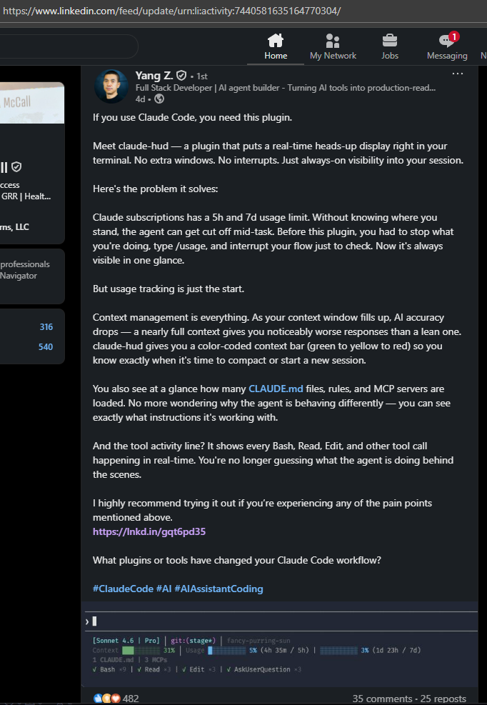
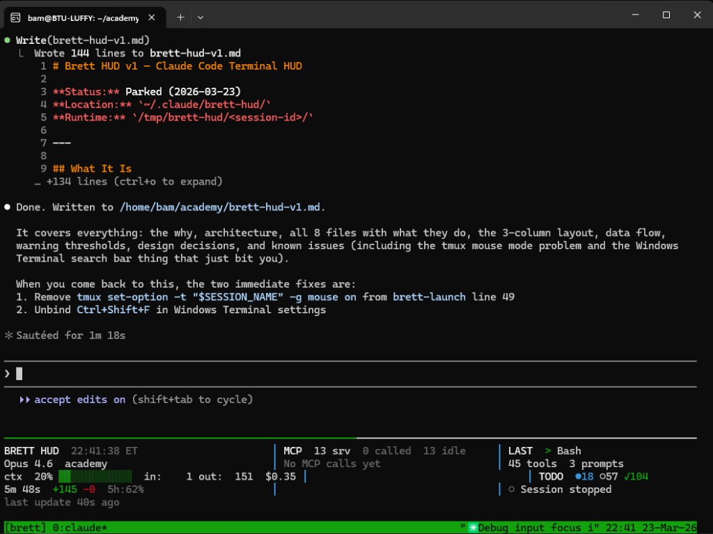

## the spark

my brother sends me a linkedin post from Yang Z. — 482 reactions, 35 comments, 25 reposts. the post is about [claude-hud](https://lnkd.in/gqt6pd35), a plugin that gives Claude Code a real-time heads-up display right in your terminal. context usage, MCP server activity, tool call history, cost tracking — all the things anthropic's native 2-line statusbar doesn't have room for.



the screenshots look exactly like what i've been wanting. a live cockpit view for my agentic workflows.

one problem: it's mac only.

## the problem

i run windows + WSL2. not macos. not native linux. the weird in-between where `fs.watch` doesn't fire reliably, tmux mouse mode conflicts with windows terminal scroll, and half the ecosystem assumes you're on a macbook. yang z.'s claude-hud is a fantastic proof-of-concept, but it's not built for my environment.

so i did what any reasonable person would do: i started building my own version at 10pm on a sunday.

## the architecture

eight files. zero npm dependencies. four processes.

```
~/.claude/brett-hud/
├── brett-launch              # tmux session orchestrator (bash)
├── bridge.sh                 # statusline bridge → state.json
├── renderer.mjs              # ANSI HUD renderer (node.js ESM)
├── package.json              # ESM config, no deps
├── hooks/
│   ├── hooks.json            # claude code hook registration
│   └── event-logger.py       # JSONL event logger
├── lib/
│   ├── state.mjs             # state aggregation + MCP scanner
│   └── format.mjs            # ANSI colors, progress bars, box drawing
└── .claude-plugin/
    └── plugin.json           # plugin manifest
```

the data flow is simple: claude code calls `bridge.sh` as its statusline script, which writes `state.json` atomically (write to `.tmp`, then `mv -f`). simultaneously, claude's hook system fires `event-logger.py` on every tool use and prompt, appending to `events.jsonl`. the renderer watches both files and redraws a 3-column ANSI layout at 300ms throttle.

## the layout

```
───────────────────────────────────────────────────────────────────
BRETT HUD  22:41:38 ET         │ MCP  13 srv  0 called  13 idle │ LAST  > Bash
Opus 4.6  academy              │ No MCP calls yet               │ 45 tools  3 prompts
ctx  20% ▓▓▓░░░░░░░  in:  1k  │                                │ TODO  ●18 ○57 ✓104
    out:151  $0.35             │                                │
5m 48s  +145 -0  5h:62%       │                                │ ○ Session stopped
───────────────────────────────────────────────────────────────────
```

**column 1** — identity + usage: model, directory, context window % with color-coded bar (green → yellow → red), tokens in/out, cost, duration, rate limit pressure.

**column 2** — MCP activity: how many servers are configured, how many have been called, which ones are getting chatty (yellow at 10 calls, red at 25). when you're running 16 MCP servers across multiple projects, this is the signal that tells you which one is burning your context.

**column 3** — activity + health: last tool call, todo progress, and a health check that warns you about context pressure, rate limit proximity, cost overruns, and chatty MCPs before they become problems.



## the wsl2 traps

building this on WSL2 exposed exactly the rough edges you'd expect:

**`fs.watch` is unreliable** — the linux filesystem events don't bubble up consistently through the WSL2 VM boundary. i added a 2-second polling fallback as a safety net, so the renderer never goes stale even if the filesystem watcher silently drops.

**tmux mouse mode hijacks scroll** — i learned this the hard way. setting `tmux set -g mouse on` captures the scroll wheel, which means you can't scroll up through claude's output anymore. it felt right for a traditional terminal app but it's completely wrong for a HUD that sits below the main workspace. removing it is the first fix before next session.

**windows terminal search bar steals focus** — `Ctrl+Shift+F` opens windows terminal's own search instead of passing through. you have to unbind it manually in windows terminal settings. small paper cut, big annoyance.

## what i learned

the delta between "i want a HUD" and "i have a working HUD" was about 5 hours of focused claude code pairing. here is the interesting part: i was using claude code to build a monitoring tool for claude code. recursive tooling. the agent building its own cockpit instrumentation while flying.

the design decisions that mattered most:
- **zero dependencies** — if you need npm install to run a terminal HUD, you've already lost
- **JSONL for events** — append-only, atomic under `PIPE_BUF` on linux, trivially parseable
- **atomic state writes** — write to `.tmp`, `mv -f` to final path. no partial reads, ever
- **plugin system hooks** — register via `.claude-plugin/plugin.json` so hooks auto-load without touching settings

## what's next

the HUD is parked — functional but not wired. the two immediate actions:

1. remove `tmux set-option -t "$SESSION_NAME" -g mouse on` from `brett-launch` line 49
2. unbind `Ctrl+Shift+F` in windows terminal settings
3. wire `bridge.sh` as claude code's actual `statusline` script so real data flows through

the inspiration from yang z.'s claude-hud was the catalyst, but the implementation is completely different — different architecture, different runtime assumptions, different platform. that's the whole point. good tools get forked into the shape of the environment they'll actually run in.

## distillation

you don't need permission to instrument your own tools. if the vendor dashboard doesn't show you what you need, build the cockpit yourself. the best developer experience is the one you designed for exactly how you work.
