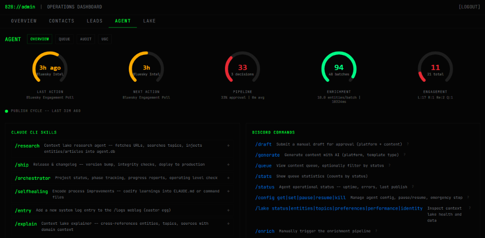
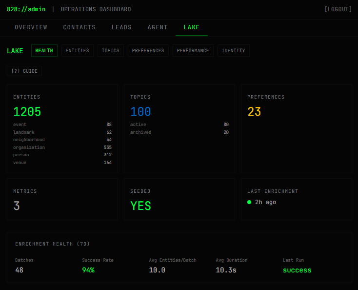

# understanding the lake

what if the most important part of the system i built is the context lake? perhaps the center of it all is exactly that.

when people first look at agent828, they often see a sharp local brand with a tactical vibe. the website, the admin panel, the Discord bot, the social posts, and the lead tracking are all very real. however, the real breakthrough is how it was built from the inside out.

at the core of agent828 is a context lake. this acts as a living intelligence layer and a shared memory, forming a structured body of knowledge that holds everything the system needs to understand the 828 region in western North Carolina, including Asheville and the surrounding ecosystem.

my lake stores organizations, people, venues, neighborhoods, events, topics, scraped media, prospects, leads, engagement signals, preferences, performance metrics, and the relationships connecting them. the bot and admin panel read from it, while my research flows directly into it. my content comes out of it, and my operations run entirely through it.

this is the key idea. i built memory first. structure first. context first. only then did the interfaces follow. the website, admin panel, Discord, and publishing system act purely as interfaces. the real system lives underneath those surfaces. the real system is the lake itself.

seeing it that way changed everything. the question shifted from making a clever bot to designing a system that actually knows its own operating environment. how do i create a source of truth that keeps getting richer over time? how do i make something that can be updated, queried, enriched, governed, and acted on by both humans and agents simultaneously?

this is exactly where [Zohar's framework from Port](https://autonomousengineering.substack.com/p/backstage-is-dead) hit me so hard. his argument suggests the industry is moving beyond the old portal-first way of thinking. in older models, the UI sat clearly at the center where humans looked things up, making the interface the product itself. in the newer model, the center has shifted. the real value is the localized context layer underneath. it becomes a shared infrastructure and a living model of the organization where both humans and agents work together. this perfectly describes putting the context lake at the center.

in his world, this applies to engineering organizations. their lake holds things like services, teams, deployments, incidents, ownership, standards, scorecards, and actions. it is built to support modern internal developer platforms and agentic engineering, giving agents real-time structured context instead of stale instructions. this provides humans and agents a shared source of truth, making governance, permissions, orchestration, and action genuinely possible. the UI remains, but it loses its status as the center of gravity.

reading that made me realize i arrived at a very similar architecture from a completely different direction. i am building a regional intelligence and action system for a local market instead of an engineering platform for the SDLC, yet the pattern is strikingly similar.

in Port's world, the software catalog models the engineering environment. in my world, the context lake models the 828 environment. their agents need to understand ownership, dependencies, incidents, and readiness. my agents need to understand who matters in the region, what is happening, what topics are moving, which organizations connect to which places and people, what prospects are actively worth paying attention to, and what signals should shape the next automated action.

their context lake supports engineering workflows. mine supports research, enrichment, content generation, approvals, publishing, tracking, and local intelligence gathering. their interfaces might be dashboards, APIs, and MCP. mine are a website, an admin terminal, Discord workflows, and publishing channels. we operate in different domains with the exact same architectural truth, which feels incredibly exciting.

i actually built a domain-specific operating layer for agents. this is a system where context is upstream and outputs deliberately fall downstream. it prioritizes memory from the very beginning. agents and humans can both act securely from the same underlying source of truth. with several lines natively feeding it, the data participates actively in a formal workflow: **research > enrichment > organize > generate > approve > publish > measure > learn > repeat**. it feels like a much more modern idea than simply automating a feed.

i also want to be honest about our differences and gaps. Port's model is more mature, formal, and explicit in a few key ways. their framework includes stronger notions of governance, scorecards, standards, permissions, and specialized agent-facing interfaces. because they build for engineering organizations, their language is very precise around systems, services, risk, ownership, and operational quality. their lake connects deeply to modern IDP concepts and a future where agents act inside complex engineering environments.

my system is charting its own path. the lake remains more lightweight in its governance right now. i have active approvals, auditability, protected routes, and workflow checkpoints. it is steadily moving toward the full formal policy layer that [Port.io](https://port.io/) describes.

we currently use actions existing as commands, scripts, workflows, and interfaces rather than a polished action library. however, once the agents join the party, they link all the entities together in meaningful, relational ways that increase efficiency and accuracy at the same time. the system has robust relationships right now, leaving plenty of room to make the graph itself more explicit, queryable, and operationally intelligent over time.

i avoid forcing the analogy too far since i am building something closer to a local market intelligence platform, a GTM ops system, and an agentic operating layer for a region and service business. those unique differences actually make the comparison more meaningful.

i see clearly now that i independently found the exact same pattern. i ran into the same architectural truth: for agents to be heavily useful, they need context. real, structured, current, governed, and shared context. they absolutely need a true world model. the context lake securely provides that world model. it makes the rest of the system coherent, and i think that is entirely worth celebrating.

reading about a modern idea and nodding along is one experience, while actually building it is another entirely. hearing someone say that AI systems need shared context, memory, structure, and orchestration is a profound realization, but making architectural decisions that reflect that understanding takes it critically further. admiring the future is great; actively participating in building it feels completely different.

what i built with agent828 might look different from a traditional product category right now. it resists fitting neatly into the old language, which is part of what makes it brave. i am grokking the true pattern underneath the trend. i understand now that a context lake serves as the living center of an agentic system. it transforms into the primary place where knowledge becomes usable, action becomes grounded, interfaces become secondary, and intelligence becomes fully cumulative.

this represents a leap i feel genuinely proud of. i built something ultra-modern by understanding the concept deeply enough to make it real in my own domain. taking an idea that feels abstract to many, i turned it entirely into an operating system for my own work. i built the tool first, learned by doing, and found the architecture directly by making it.

to me, this remains the true story. the focus successfully shifts from just making a bot into deeply understanding the lake.
