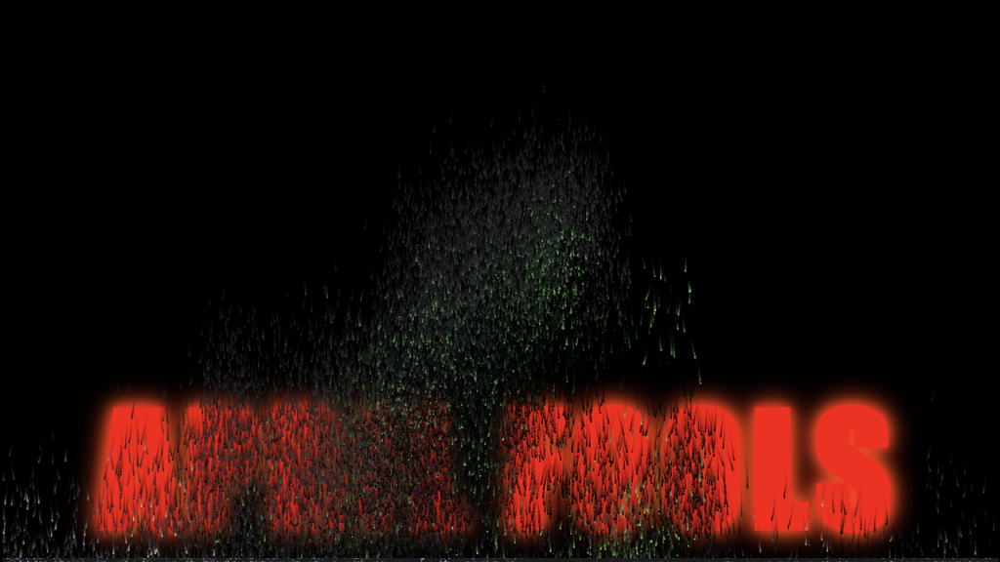
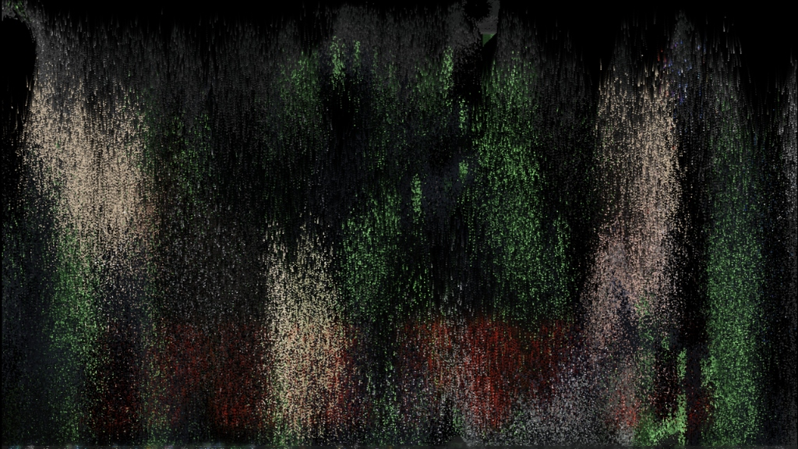

# the melt

april first. the one day a year where chaos is not just permitted but expected. wanted to build something that would make friends question reality for a few seconds before the relief hits.

the idea was simple enough: take an image, turn it into particles, watch it decay. physics. gravity. puddles forming at the bottom. but underneath the melting pixels — big red letters waiting. APRIL FOOLS.

started with the particle system. every pixel cluster becomes its own little entity with weight and velocity. some stick before falling. surface tension. others just let go immediately. randomness makes it feel organic rather than mechanical.

the decay itself needed to feel like rot, not deletion. seed points that bloom outward like mold. drip columns that race faster than their neighbors. contagion spreading from loose particles to their still-solid siblings. watching it run looks less like a screensaver and more like something dying.

added sound. first attempt was a drone — oscillators layered into something dark and rumbly. hated it immediately. switched to crackling. filtered noise bursts. random pops. fire eating through paper. much better.

then the reveal. text starts hidden behind the image. as particles fall away, transparency opens up. red impact font glowing through the gaps. the punchline emerging from the destruction.

last touch: click anywhere the image has decayed and ripples bloom out. chromatic aberration splitting the rings into rgb. turbulence warping the circles. a small reward for poking at the void.

the whole thing runs in a single html file. canvas api. web audio. no dependencies. just math and timing and the satisfaction of watching something beautiful fall apart on purpose.

tonight it gets deployed on unsuspecting friends. tomorrow we measure success in confused text messages.
