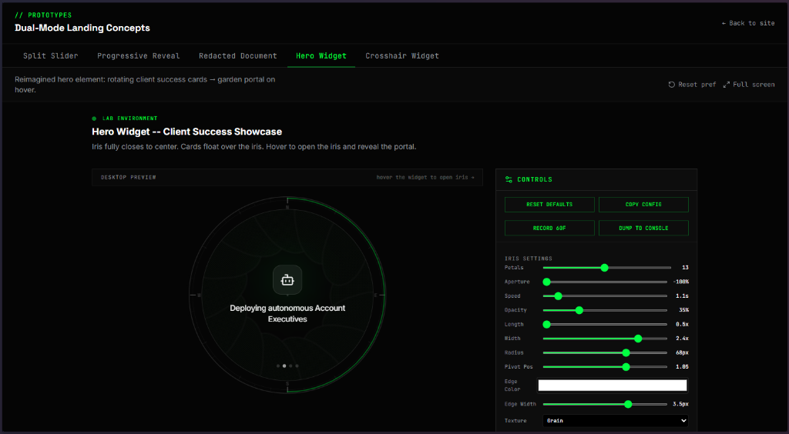
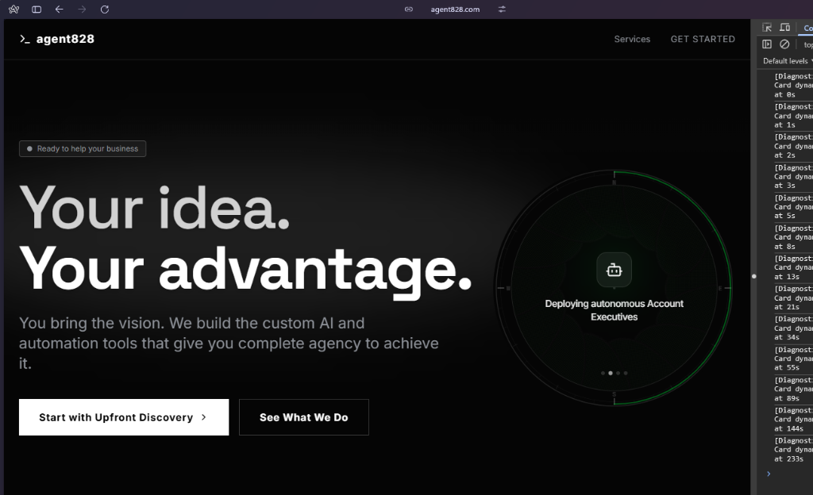

# weaving the universe into the code

## the tooling genesis

when we set out to build the iris aperture widget, the goal was straightforward: a high-fidelity, interactive focal point for the hero section. we built an entire tactical control panel (HUD) overlay just to dial in the perfect visual balance of blade widths, petal overlaps, corner radiuses, and translucencies. it was a massive undertaking of precision.

at the end of this engineering exactitude, we stumbled. a classic "stale closure" bug in our react hooks meant the active index state wasn't updating correctly over time. instead of advancing smoothly every 4.5 seconds like a swiss watch, the timer would hang, seemingly broken… until a mouse movement or hover caused a state refresh, unjamming the cycle momentarily.

it felt like failure. but then, it didn't.

## where the magic lies

[Derek Thompson](https://tarottalks.app/talks/derek-thompson-the-four-letter-code-to-selling-anything) talks about the story of Spotify's *Discover Weekly*. early on, a bug in the algorithm allowed familiar, already-loved songs to bleed into the playlist designed entirely for *new* discovery. the engineering team panicked and fixed the bug. but to their surprise the engagement data told the story... people *loved* the new discovery-forward playlist *with* a few "familiar" songs mixed in. the familiar songs acted as anchors, grounding the listener enough to trust the new, foreign tracks.

this is my favorite part of bug hunting... often the bug appears as a mistake, but the game designers mind will see the magic and genius upon reflection. the magic lies strictly *outside* our normal seeing and expectations of what we thought "done" was going to look like. its not perfection... its [kintsugi](https://en.wikipedia.org/wiki/Kintsugi).

when the iris rotation jammed up and displayed an increasing, chaotic delay, it initially felt broken. replicating it was illusive because the response was inconsistent. and i started to feel *anticipatory*. the behavior felt *alive* and *organic*. i knew the tooling i wanted to build.... and suddenly my coding agent "fixed" the bug without me asking: a perfectly uniform 4.5-second rotation is mechanical.... sterile. i realized the delay pinged a breath into the site in exactly the way i wanted this hero image to play.

## Alan Watts and the sequence

instead of "fixing" it back to a predictable dogmatic militant drum beat of a rhythm, decided to lean in and play, adopting an intentionally *expanding* chronological gap. we didn't choose just any arbitrary timing... we chose the **fibonacci sequence**.

`0, 1, 1, 2, 3, 5, 8, 13, 21, 34, 55, 89, 144...`

to the logical mind, it's a math equation. but as Alan Watts would say, the universe itself is fundamentally rhythmic — a vibrating expression of patterns that we pretend are separate from us. the fibonacci spiral defines the unfurling of a fern, the shape of a galaxy, the proportions of a human face, and the swirl of a pinecone. it's the universe's internal ratio for growth, expansion, and unfolding truth.

by weaving the fibonacci sequence strictly into the auto-rotation delay of this digital aperture, something new is born: we are writing a love letter back to the universe. we are incorporating the most fundamental signature of the living world into our digital fabric.

reminds me of sitting by the Swannanoa and French Broad rivers for decades now.... one day i realized these rivers are "always talking" and they have the most important stories to tell. but will we sit and listen?

designing this felt like saying: *"we are the river who is always talking.... will you listen?"*

every time that iris expands — waiting 5 seconds, then 8, then 13 — it echoes the blooming of a flower. it's an unspoken, beautifully artistic expression of life, hiding quietly in the console logs of our application. all the time. every beautiful day.

