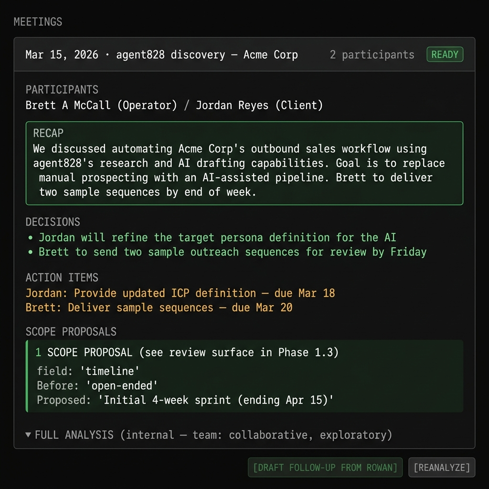
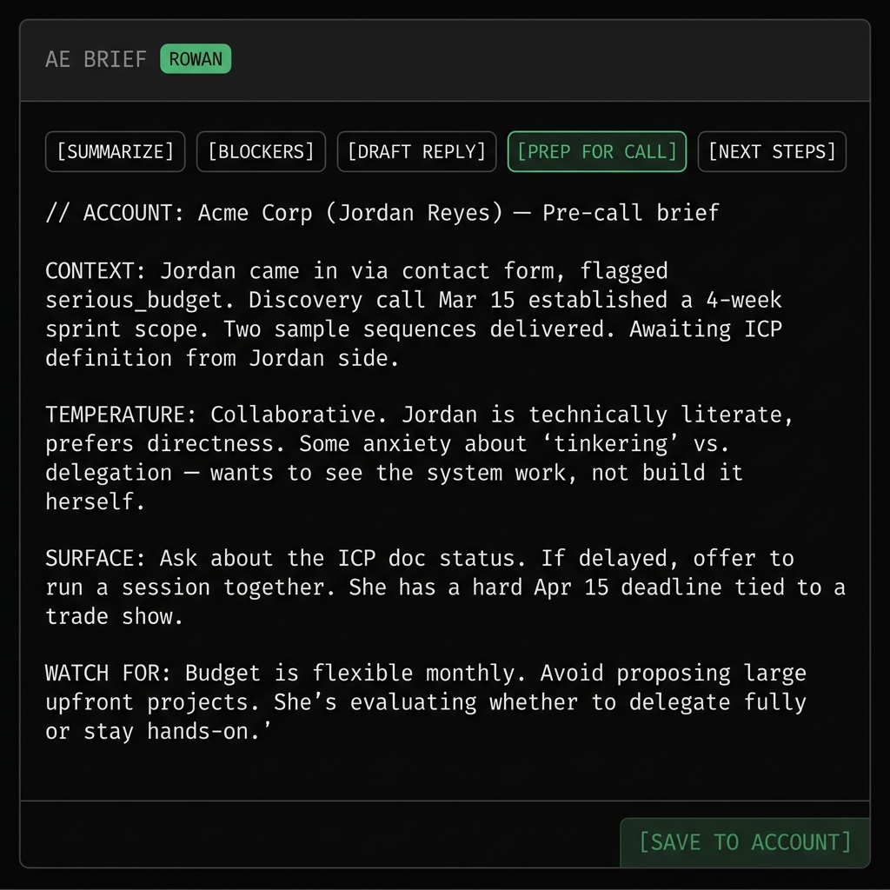
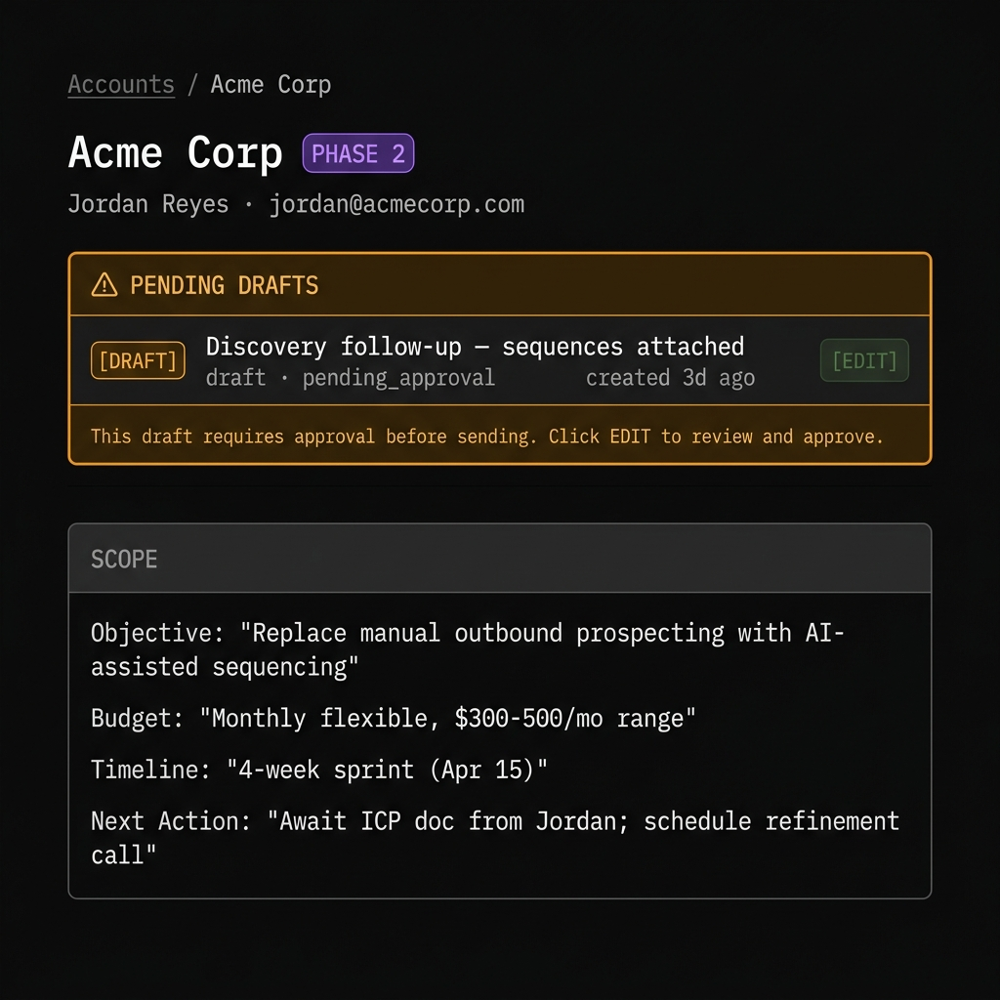
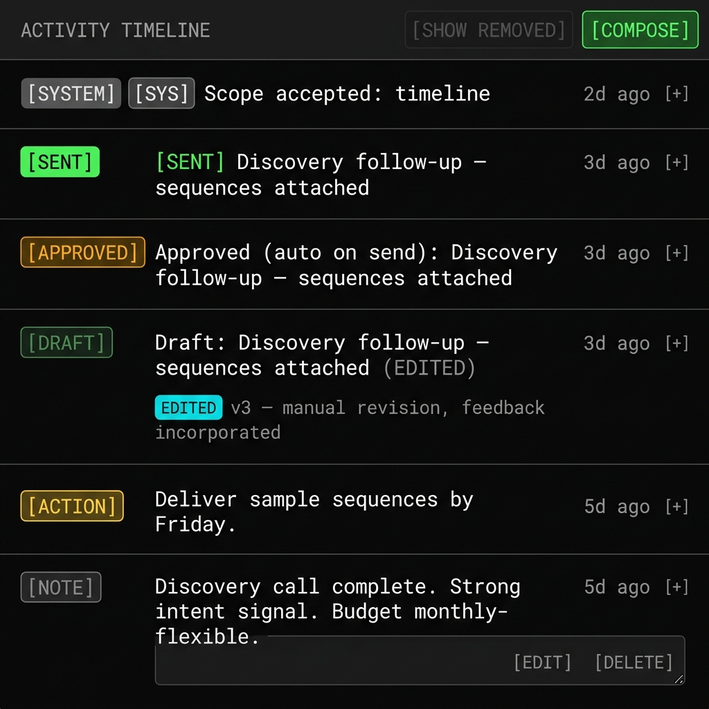

# the crm that drafts its own follow-ups

three weeks. one sales team of one person (me). and now the CRM writes first drafts, remembers every meeting, and will not send a single email without a human saying yes.

here is what that arc actually looked like.

## the problem with meeting transcripts

before this, a meeting happened and the transcript lived in a google doc that nobody opened again. the lead record had a status and a next_action date and a note that said "good call - following up." the CRM had no idea the call happened. the AE brief had no idea what was said. the next outreach was written from scratch.

this is not a tooling problem. it is an architecture problem. the transcript never became a first-class artifact.

**phase I.1** fixed that. every meeting transcript now ingests into a `meeting_transcripts` table with a SHA-256 hash for dedup, a participant list, an analysis status, and a foreign key back to the account. pasting the same transcript twice no-ops. the same transcript on a different account is a different row. the record now knows the meeting happened.

## the analysis worker

ingesting a transcript is table stakes. the value is what you extract from it.

**phase I.2** shipped the analysis worker. after ingest, it fires asynchronously and produces three things:

1. a **client-facing recap** — concise, under 500 chars, the kind of thing you'd send if you had to brief someone in 30 seconds. decisions made. action items with owners and due dates. next step.
2. a **team-facing full analysis** — tone, stakeholder reactions keyed by name, concerns surfaced, categorized signals with quotes. the stuff you'd write in the margin of a call notes doc if you were honest.
3. **scope proposals** — when the transcript clearly changes something we thought we knew (objective, budget, timeline), the worker surfaces a before→after pair with rationale. it does not just apply the change. it queues it for review.

that last part matters. the system proposes. the operator decides. nothing changes in the lead record without a human clicking ACCEPT.

## drafts that know what was said

**phase I.3** wired the puddle to the meetings. the context puddle — the structured object that assembles every known fact about a lead before any LLM call — now includes the last 3 analyzed meetings. summary, tone, signals, concerns. hard-capped at 2KB so the prompt doesn't balloon.

the consequence: when phase I.4 ships the `DRAFT FOLLOW-UP FROM ROWAN` button, the draft is not a generic reply. it's a draft that knows what tone the meeting ran at, what concerns came up, what the client said they needed next. the AE-voiced follow-up lands with transcript attached. subject pre-threaded. from-address accurate.

this is the delta. it's not that the draft is better. it's that the draft is downstream of the truth.

## the AE brief

five chips. one question. nine seconds.

`SUMMARIZE` / `BLOCKERS` / `DRAFT REPLY` / `PREP FOR CALL` / `NEXT STEPS` — or type a free-form question. temperature 0.4. Gemini 2.5 Flash on top of the full context puddle. the brief knows about the meeting that just happened, the emails that were sent, the scope changes that were accepted, the timeline the client named.

i can prep for a call in nine seconds. i type "what do i need to know before this call" and i get the brief. it is so much faster than re-reading the entire history that the first time it worked i sat there for a beat trying to figure out what i had broken.

## the approval gate

**phase L** introduced the state machine: `pending_approval → approved → sent`.

AI-authored drafts — meeting follow-ups, draft replies, AE brief outputs — start in `pending_approval`. a rep cannot send them without an explicit APPROVE step. the send gate will 409 if a pending draft tries to ship without the flag.

the decision to build this now, before any fully autonomous AE goes live, was intentional. the gate costs almost nothing when it's just me clicking approve. it costs enormously if you skip it and then add autonomous agents later and have to retrofit it.

the rule: the system writes. a human approves. we never auto-send.

## collaborative revisions

**phase I.5** added the revision loop. the operator reads a draft, types feedback, the AE revises. every version is preserved. `current_revision_id` tracks the head. `sent_revision_id` records what actually went out. stale-tab protection: if the compose modal has an old revision open and someone else updated the draft, the send returns 409 with both IDs so nobody sends stale content blind.

the model: non-destructive history. approval required on the head, not a prior revision.

## the editable activity log

**phase N** was the one i did not anticipate needing.

the activity log was read-only. you could see what happened but you couldn't fix it. if a note was wrong, it was wrong. if a meeting detail was miscaptured, it stayed miscaptured. and every AE brief and draft that ran after that was downstream of the wrong record.

now every activity row is editable. every edit writes a revision, preserving the original. every save re-runs the Lead Action Engine and re-shapes account memory so future briefs and drafts reflect the corrected truth. the operator sees toast feedback: green when the AE context refresh succeeded, amber when it partially failed, explicit message when it didn't run.

a broken CRM record is not a data quality problem. it's a downstream trust problem. every downstream output is only as honest as the record it reads.

## the /AEbrief skill

the capstone was `/AEbrief`. a slash-command for the terminal that runs a structured portfolio sweep — no AI calls, just SQL — and can optionally go per-record with Gemini.

the completeness contract: four paths. account ownership via `account_rep_assignments`, ownership via the primary lead's `assigned_rep_id`, ownership via any linked lead, standalone unpromoted leads. the brief opens with a mandatory coverage header so any future SQL regression that silently drops a path becomes visible at the top of the output instead of quietly shrinking the brief.

running `/AEbrief rowan` from the terminal gives a full book of business in 30 seconds. what's warm, what's stale, what's got a pending draft sitting unreviewed, what's got a possible duplicate that needs a merge decision.

## what this is

it is not a SaaS product. it is a working system, built by its own first user, using the same pipeline it's supposed to manage.

the phases: **I.1** (transcripts as artifacts) → **I.2** (analysis worker) → **I.3** (scope queue + puddle enrichment) → **I.4** (AE drafts with attachments) → **I.5** (collaborative revisions) → **L** (approval gate) → **N** (editable activity log + context refresh) → **/AEbrief** (portfolio in 30 seconds).

three weeks. one arc. the CRM now writes its own follow-ups. it just won't send them without you.

## we can build this for your sales team

3 weeks of agent dev = your AEs stop typing cold outreach from scratch and start approving drafts that already know what was said in the last call.

if your reps are re-reading their own notes before every follow-up, there is a better way.

## distillation

the hardest part of building a CRM that thinks is not the AI. it's the approval gate. build the human-in-the-loop before you need it, not after.

* * *

shipped: meeting transcripts table (I.1), analysis worker with recap + full analysis + scope proposals (I.2), scope review queue + puddle enrichment (I.3), AE follow-up draft with transcript attachment + from-address fix (I.4), collaborative draft revisions + stale-tab 409 (I.5), draft approval state machine pending_approval→approved→sent (L), editable activity log + revision history + AE context refresh fan-out (N), /AEbrief skill with 4-path completeness contract (v0.3.61). full arc: v0.3.41 → v0.3.61.
