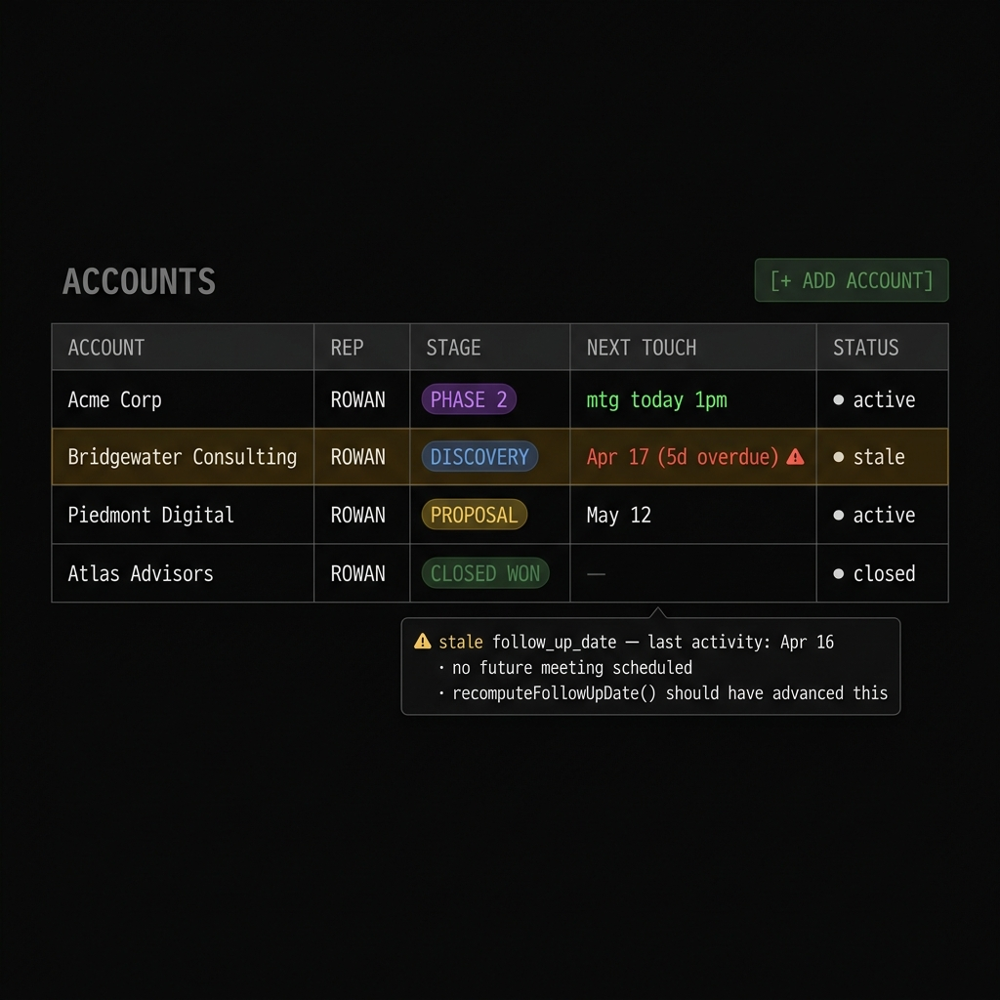
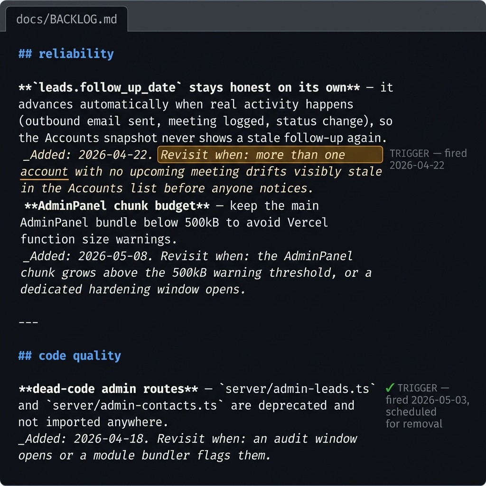

# the honest column: making follow_up_date derive from facts

there is a class of CRM bug that is not a bug in the code. it is a bug in the design.

the code works exactly as written. the data is wrong. and the wrongness accumulates quietly over time until someone opens an account and sees a follow-up date from three weeks ago, stares at it for a moment, and thinks: "is this right?"

it is not right. but nobody touched anything. nothing broke. the column just drifted.

## before: the view-layer patch

`leads.follow_up_date` was being set by the Lead Action Engine when a lead was created or classified. then it stopped being updated. real activity — meetings, emails, status changes — did not write back to the column. the column reflected the initial classification, not the current state of the relationship.

the Accounts list derived "Next Touch" at read-time from the nearest future meeting across linked leads, falling back to `follow_up_date` only when there was no meeting. this is a view-layer patch. it makes the UI look right while the underlying data is wrong.

Brett caught it immediately after the accounts snapshot shipped. Lauren's account showed "2026-04-17 (5d overdue)" even though a meeting was scheduled for that day at 1pm and an email had gone out 9 hours earlier. the column had not been touched since the original classification.

the BACKLOG entry captured it cleanly:

> **`leads.follow_up_date` stays honest on its own** -- it advances automatically when real activity happens (outbound email sent, meeting logged, status change), so the Accounts snapshot never shows a stale follow-up again. _Added: 2026-04-22. Revisit when: more than one account with no upcoming meeting drifts visibly stale in the Accounts list before anyone notices._

## the philosophy of deferred versus computed

here is the question the entry doesn't answer: **should `follow_up_date` be stored or derived?**

stored means you write it on every activity event. it's a persistent fact. it can be queried directly without a join. it's accurate until the next event doesn't write it.

derived means you compute it at read-time from the fact table. it's always correct. but you're paying for the computation on every read. and the computation is hidden from anyone who queries the column directly.

the read-time derivation (the view-layer patch) won the performance argument. it won the "always correct" argument. but it lost the "honest data everywhere" argument. anyone who queried `leads.follow_up_date` directly — in a report, in an export, in an /AEbrief query — saw the stale value.

the write-time fix wins the "honest everywhere" argument. when real activity lands, the column gets recomputed. not patched. recomputed from facts.

## recomputeFollowUpDate

the fix is a function called `recomputeFollowUpDate(leadId)`. the logic:

1. if the lead is closed or lost → null (closed leads don't have follow-up dates)
2. if there's a future meeting on the account → that meeting's date (meeting wins)
3. else → last touch date + 3 days

three cases. derived from three categories of facts. no magic constants except the 3-day default, which reflects a real operating assumption: if nothing else is scheduled, check in within 3 days.

this runs at the tail of the Lead Action Engine on the `activity_edit` trigger (phase N). it runs when a meeting is logged. it will run on outbound email send when that path is extended.

the column stops being a fossil. it becomes a computed fact that reflects the current state of the relationship.

## the dedupe-entities connection

the same session surfaced a different version of the same pattern in the lake.

entities were drifting in from enrichment with multiple types for the same canonical name. `Asheville` existed as both `neighborhood` and `organization`. `North Carolina` existed as `landmark`, `organization`, and `neighborhood`. the schema's `UNIQUE(canonical_name, type)` index permitted this — it only enforces uniqueness per (name, type) pair, not per name.

the enrichment prompt had been inconsistent. the lake had multiple rows representing the same real-world thing, with different types, different relevance scores, no clear winner.

`dedupe-entities.ts` is the planned fix: a one-time audit that lists every canonical name with more than one type, applies a precedence rule (landmark > neighborhood > organization for geographies), merges the lower rows into the survivor carrying their `source_item_ids` and `aliases`, and tightens the enrichment prompt with pinned examples.

same pattern. different table. data that was written multiple times under different assumptions, now inconsistent, and the system can't tell which version is right.

**the database lies when nobody owns the recompute.**

## why this matters for SDRs and RevOps

every CRM has this problem at scale.

follow-up dates that nobody refreshes. contact records that reflect the qualification call from six months ago. account stages that haven't been touched since the deal closed. the columns exist. the data is wrong. the reports are wrong. the forecasts are wrong. people add "last-verified" fields and "as of" notes to patch the thing they should have fixed at the write layer.

the fix is always the same: find the facts. define the recompute rule. fire the recompute whenever a relevant fact changes.

that is not a data engineering project. it is a design decision.

## your CRM lies because nobody owns the recompute

the code is not broken. the design assumed someone would keep the column current. nobody did. nobody could. activity volume is too high. the assumptions change too often.

the recompute needs to be a function that fires automatically when the facts change. not a human process. not a nightly batch. a real-time write that happens whenever a meeting is logged, an email goes out, a status changes.

the column is honest when the system owns it. the system owns it when the recompute is wired to the write path.

---

*screenshots to add: Accounts list with Next Touch column showing "mtg today 1pm" vs stale follow_up_date comparison, BACKLOG.md entry with trigger condition highlighted*

## distillation

a column is a claim. "this is the follow-up date." if the system doesn't keep that claim current, the column is a lie. the fix is not a better query. it's a recompute that fires whenever the underlying facts change.

* * *

shipped: `recomputeFollowUpDate` logic (closed→null; nearest meeting; else last-touch + 3d), wired to Lead Action Engine `activity_edit` trigger, BACKLOG entry documenting the trigger condition and the `dedupe-entities.ts` follow-up. v0.3.52 + audit session 2026-05-03.
