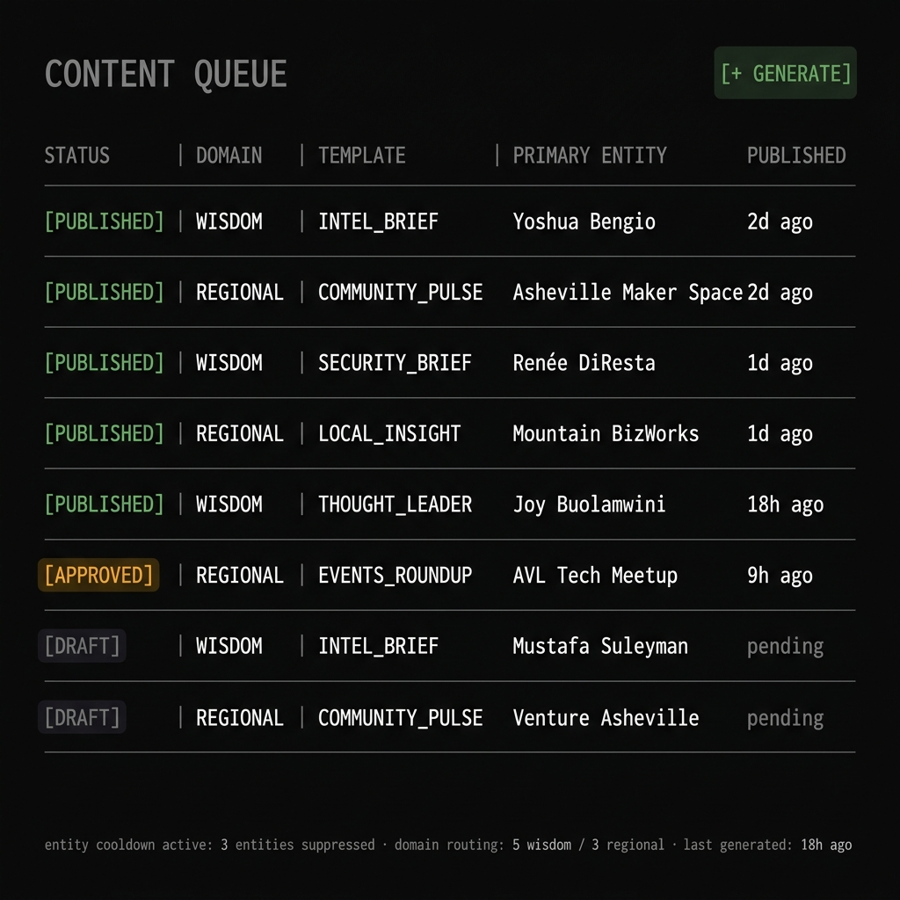
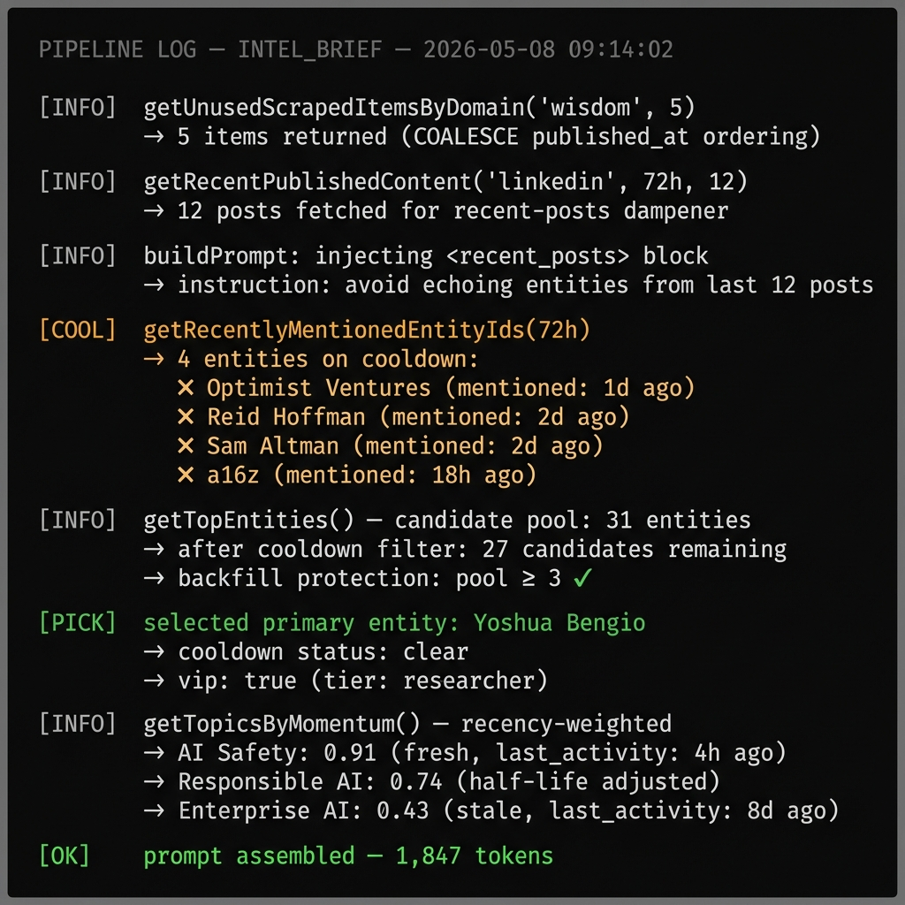

# how we stopped our content engine from repeating itself

there is a specific failure mode in AI content pipelines that nobody talks about enough.

it is not hallucination. it is not tone. it is **entity fixation** — where the model latches onto the same three companies, the same four names, the same two topics, and just keeps going back to them.

we hit it. Optimist Ventures showed up in 10 of 15 consecutive INTEL_BRIEFs. the same organization, same framing, slightly different angle, post after post. it was technically correct. it was also useless. nobody reads a content feed to see the same name rotated.

here is the four-guardrail system that killed the pattern.

## guardrail 1: domain-routed scraper retrieval

the root cause of the repetition was not the model. it was the retrieval. every template was pulling from the same undifferentiated pool of scraped content, and some sources just had more volume than others.

the fix: `getUnusedScrapedItemsByDomain(domain, limit)`. scraped items now carry a `content_domain` — wisdom (thought leadership, frameworks, research) or regional (local tech, AVL, meetups, community). templates declare a `domainAffinity` — wisdom-only, regional-only, or hybrid (3 wisdom + 2 regional).

the ordering is `COALESCE(published_at, created_at) DESC` so manual research items with null `published_at` don't get sunk by SQLite's null-last semantics. small detail. real fix.

templates that should pull from the AI thought-leader corpus now can't accidentally pull a Mountain Xpress local letter to the editor. templates that should root in the community can't get displaced by Anthropic blog posts.

## guardrail 2: recent-posts dampener

this was the strongest single fix.

`getRecentPublishedContent(platform, sinceHours, limit)` returns the last 12 posts on the same platform inside a 72-hour window. `buildPrompt` renders them as a `<recent_posts>` block with the instruction:

> "do not echo their entities, named subjects, headlines, hashtags, or framings — find a different angle."

the model sees its own recent output and is explicitly instructed to route around it. this is a prompt-level constraint, not a retrieval filter, which means it works even when the repetition would come from within-session context that a pure database filter can't see.

if you have one guardrail to add to your content pipeline, it is this one.

## guardrail 3: entity cooldown

on the lake side, `getRelevantEntities` and `getTopEntities` now consult `getRecentlyMentionedEntityIds(72)` before returning candidates. that function joins `content_queue` published in the last 72 hours against entity canonical names and aliases, and demotes any matched entity from the candidate set.

backfill protection: if the cooldown filter would drop the result below 3 entities, it relaxes and backfills from the cooled-down set. the engine never gets stuck with zero context.

the effect: an entity that just appeared in a published post is a weak candidate for the next one. it has to earn its way back into rotation.

## guardrail 4: recency-weighted topic momentum

this one is subtle but compounding.

topic clusters were being ranked by raw momentum score. a regional cluster that had been active for months could reliably outrank a fresh wisdom cluster just seeded from new research. the wisdom cluster would never surface.

`getTopicsByMomentum` now re-ranks by `momentum × exp(-hoursSinceLastActivity / 168 × ln 2)`. one-week half-life. a freshly-seeded wisdom cluster at momentum 0.5 outranks an older regional cluster at momentum 1.0 with stale `last_activity`.

recency wins. the pipeline surfaces what is actually alive, not what was alive once and coasted.

## the counterweight: VIP tier

four guardrails designed to suppress repetition. one mechanism designed to allow it when it matters.

some entities you want to surface repeatedly. AI safety researchers. documentary subjects. named thought leaders with active publishing. these are not sources of repetition — they are the signal.

`metadata.vip = true` makes an entity exempt from both the weekly relevance-decay sweep and the 90-day prune. VIP entities carry queryable structure: `metadata.tier`, `metadata.camp`, `metadata.ai_doc_2026`, `metadata.podcast_guest`. the lake knows the difference between a source worth returning to and a source the engine got stuck on.

as of v0.3.64, 42 VIP entities are marked — 37 from The AI Doc (2026) cast, 5 from Sinead Bovell's IGQ podcast cohort. Demis Hassabis, Yoshua Bengio, Joy Buolamwini, Renée DiResta, Mustafa Suleyman. these names should appear in the feed. the cooldown mechanics don't apply to them.

## the defunct gate

one more: `isDefunct()`. entities with `relevance_score ≤ 0` or `metadata.status = 'defunct'` are filtered out of every candidate set, regardless of text matching.

Silicon Dojo AVL was the precipitating case. it shut down on May 6, 2026. within one session: `relevance_score = 0`, description prefixed with `[DEFUNCT 2026-05-06]`, keyword scrubbed from topic seeds, removed from the knowledge base. the engine now can't recommend a defunct organization because it literally can't see it.

the operator path: set score to zero, add the defunct marker, done. no migration needed.

## what this costs

four guardrails. one VIP tier. one defunct gate.

the test suite covers: domain routing with COALESCE ordering, recent-posts window filtering, cooldown filter with backfill, min-3 protection. 440/440 green.

the change that matters most operationally is the recent-posts dampener. it costs one extra DB read per generation. it prevents the pipeline from humiliating itself by saying the same thing twice in the same week.

## if your content keeps writing about the same 5 things

this is why.

the model is not broken. the retrieval is. the pool is biased toward high-volume sources. there's no memory of what was just published. the topics that rank highest rank that way because they ranked highest last time.

the fix is not a better prompt. the fix is a pipeline that actively routes around its own recent outputs.

---

*screenshots to add: admin content queue showing diverse entities across recent posts, entity cooldown debug log showing demoted candidates, topic momentum re-ranking before/after comparison*

## distillation

an AI content engine with no memory of what it just published will repeat itself until someone fixes the retrieval. fix the retrieval before you blame the model.

* * *

shipped: `getUnusedScrapedItemsByDomain` domain routing, recent-posts dampener, entity cooldown with backfill, recency-weighted topic momentum (one-week half-life), VIP entity tier (42 entities marked), defunct gate, SECURITY_BRIEF wisdom template, 42 VIPs seeded with verified handles. 440/440 tests. v0.3.64.
